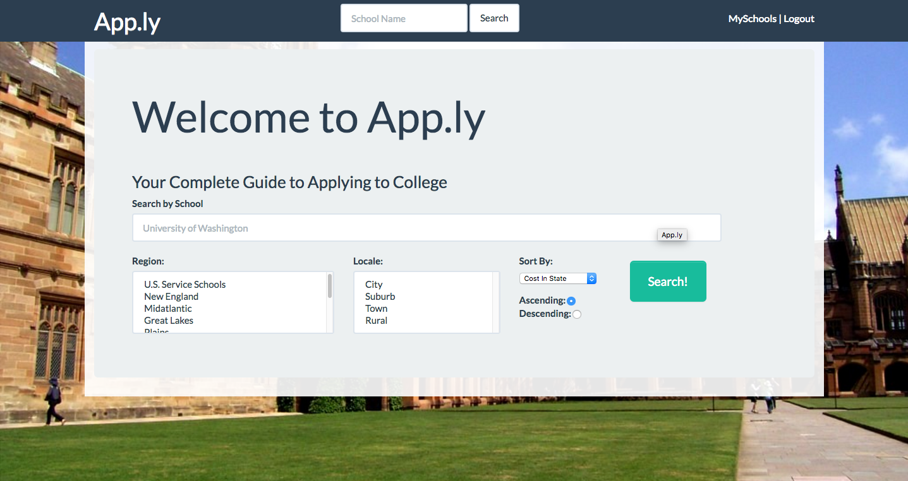
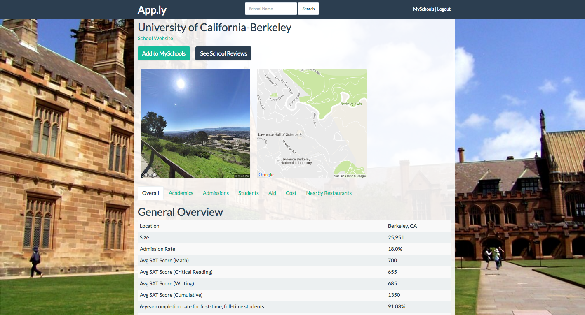
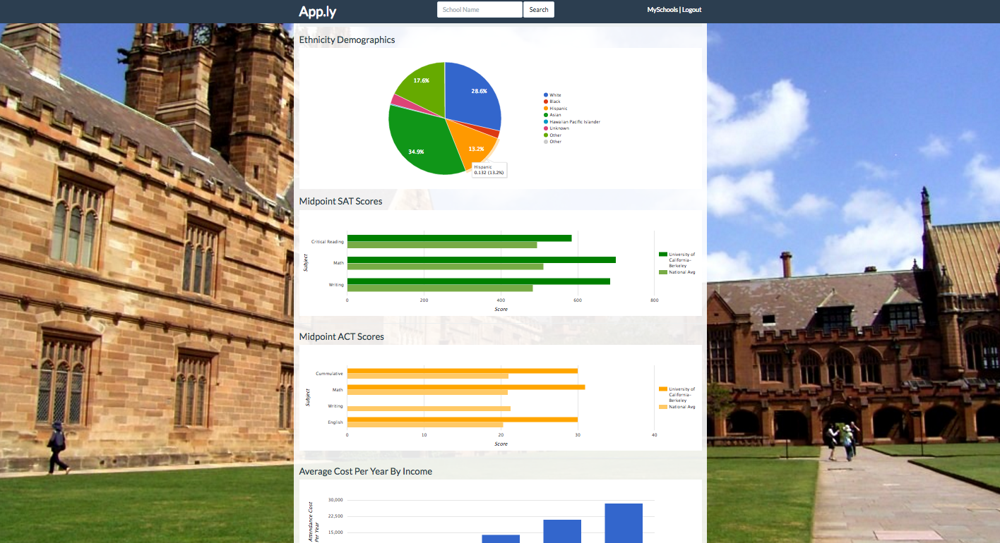
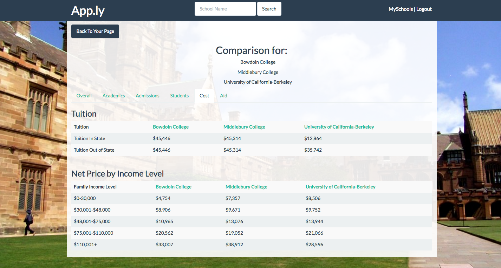
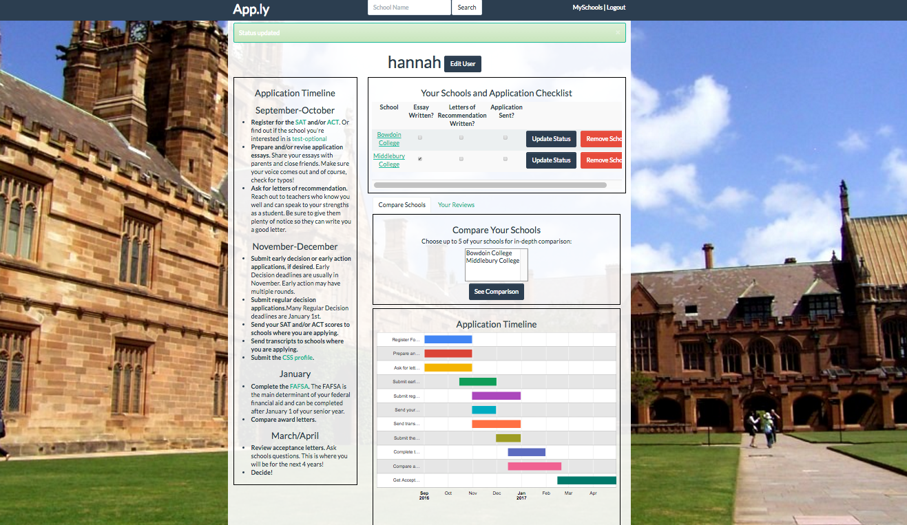
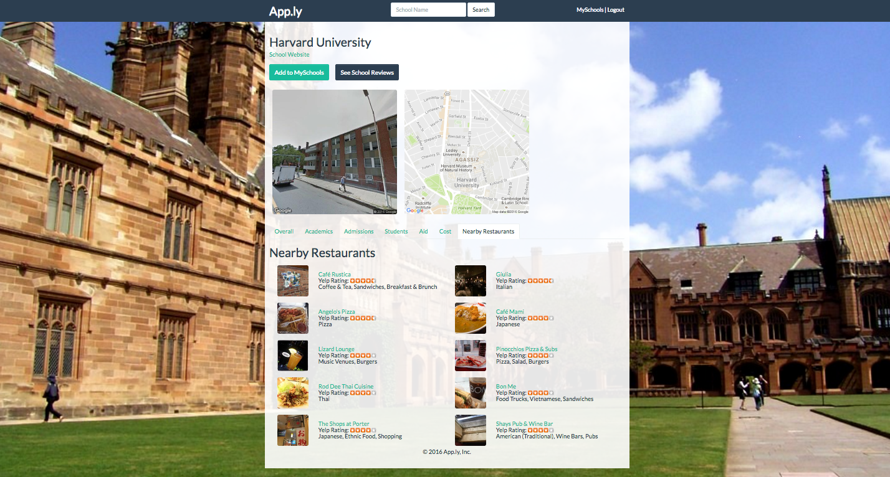
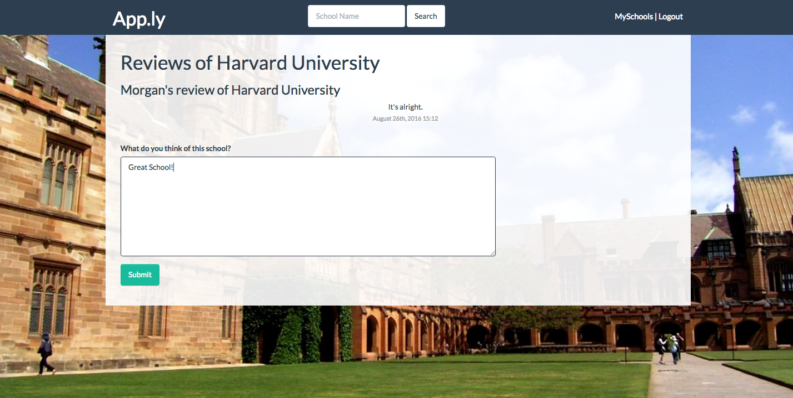

# 🎓 [App.ly](https://applyapp.herokuapp.com)

## Overview

App.ly is a resource for college applicants and their families. Easily search from 500 colleges and universities. Browse through important information about admissions, the student body, finances, and academics.

[Check it out!](https://applyapp.herokuapp.com)
## Features

Users can:
* Bookmark schools
* Compare schools
* Leave reviews
* See nearby restaurants

Data comes from the College Scorecard API.

# Preview

## 1. Search Schools By Multiple Criteria

## 2. View School Map, Image, and General Stats

## 3. Check Out Beautiful Charts

## 4. Compare Your Schools Side-by-Side

## 5. Keep Track of Admissions Process with Timeline and Checklist

## 6. See Nearby Restaurants Courtesy of the Yelp API

## 7. Leave Reviews and Check Out What Others Think of the School

## Built With

* Rails
* Ruby
* Google Maps API
* College Scorecard API
* Yelp API
* Solr
* Chartkick

## Acknowledgments
A big thanks to my team members:

* [David Jiang](https://github.com/davidmjiang)
* [Alex Lach](https://github.com/alexglach)
* [Mike Lee](https://github.com/asackofwheat)
* [Matt Hinea](https://github.com/mnd-dsgn)
* [Morgan Martin](https://github.com/morgancmartin)
* [Leo Ahnn](https://github.com/leosaysger)

### Get in touch if you are having any issues!

